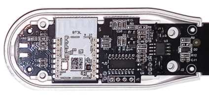
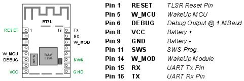

# SGS01 BTHome  
Custom firmware for the Tuya SGS01 soil sensor to send data in standard BTHome format.   


## Sensor

 

 Model: SGS01 / HZ-SL05 / "Connected Home PLANT MONITOR" / PID gvygg3m8   
 Manufacturer: Shenzhen HaiHao Electronic Co.LTD    
 Firmware: Tuya Cloud Protocol   


##  Custom Firmware Features

- Bluetooth Low Energy
- Advertising sensor data in BTHome V2 format
- BTHome data encryption supported
- BLE GATT profile to configure and secure the sensor
- Supporting OTA for firmware updates
- Extended battery life time

## Description

- The sensor is a well designed "plant monitor" with water protection and two AAA batteries for long operation
- Hardware design: a TUYA BT3L bluetooth module (TLSR8250 chip, 512k flash) and a third party MCU to measure data, control button and LED
- The BT3L module communicates with the MCU over UART serial, TUYA third party MCU protocol
- The custom firmware replaces the BT3L module firmware, handles the MCU serial protocol and send the sensor data in BTHome format

## Flashing the custom firmware   

- Unmount the 4 screws in the battery case and remove the back cover.
     
   
   
   
- TELINK BDT    
  [BDT Tool](https://wiki.telink-semi.cn/wiki/IDE-and-Tools/Burning-and-Debugging-Tools-for-all-Series/ ""): Flashing by TELink Buring and debugging tool.   
  Connect:    
>   *Sensor Vcc - BDT 3V3*   
    *Sensor Gnd - BDT GND*   
    *Sensor SWS - BDT SWM*   
  
  Select chip type 8258 to flash.  
- PVVX   
  [TlsrComSwireWriter](https://github.com/pvvx/TlsrComSwireWriter ""):
  Flashing by "USB/TTL adapter" and PVVX python script.   
  Connect:   
>    *Sensor Vcc - TTL 3V3 (ensure 3.3V power)*   
    *Sensor Gnd - TTL Gnd*   
    *Sensor SWS - TTL RxTx*   
    *Sensor Reset - TTL Rts*   

- Note: If the sensor firmware was updated by OTA, erase flash sectors 0x00000 - 0x3FFFF. DO NOT erase flash sectors above 0x70000, here is the manufactor pre-programmed area (MAC address and chip calibration data).    
- May read out the original firmware (first 128k) before flashing.
- Firmware files are located in the subdirectory **/fw**.
- Flash the xxx.bin at start address 0x00000.    

## Getting Started    

- No time? Just flash the module and insert batteries. The sensor will start up in connection mode (LED flashing) and changes after 60 seconds to measure mode - advertising BTHome data.   
- For configuration and encryption have a look at the manual. [```PDF```](wiki/SGS01-BTHome-Manual.pdf)    

## Links    

- BTHome Format [```https://bthome.io/```](https://bthome.io/)    
- TELink Wiki [```https://wiki.telink-semi.cn/wiki```](https://wiki.telink-semi.cn/wiki)    
- TUYA MCU Protocol [```https://developer.tuya.com/en/docs/mcu-standard-protocol/mcusdk-protocol```](https://developer.tuya.com/en/docs/mcu-standard-protocol/mcusdk-protocol)    

## Licence
- Open Source [Apache License, Version 2.0](http://www.apache.org/licenses/LICENSE-2.0)  
Unless required by applicable law or agreed to in writing, software
distributed under the License is distributed on an "AS IS" BASIS,
WITHOUT WARRANTIES OR CONDITIONS OF ANY KIND, either express or implied.
See the License for the specific language governing permissions and
limitations under the License.
- Copyright (c) 2025, haraldapp, [```https://github.com/haraldapp```](https://github.com/haraldapp)
  
<br>
  
**Thanks to**
+ [pvvx](https://github.com/pvvx) for excellent work on TLSR chips
+ Shelly/Allterco for defining an open standard and registering the BTHome UUIDs at the Bluetooth SIG organisation


